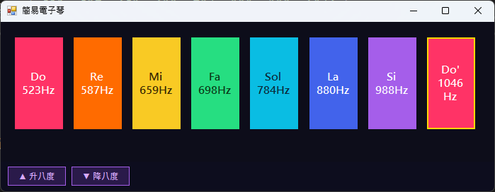

# 簡易電子琴
視窗程式設計 (II) 上課練習

## 功能介紹

* 點擊琴鍵播放對應音符（Do、Re、Mi、Fa、Sol、La、Si、Do'）
* 每個琴鍵顯示音符名稱與對應頻率（Hz）
* 升八度／降八度切換，最多各升降兩個八度
* 視窗可自由縮放，琴鍵等比例調整大小
* 關閉視窗前跳出確認對話框

## 使用方式

1. 點擊任意琴鍵播放對應音符
2. 點擊「▲ 升八度」將所有音符頻率提高一個八度
3. 點擊「▼ 降八度」將所有音符頻率降低一個八度
4. 拖動視窗邊框調整大小，琴鍵會自動等比縮放

## 音符對應表

> 以下頻率為預設（未升降八度）時的對應值，升降八度後頻率會等比倍增或減半。

| 琴鍵 | 音符 | 頻率 (Hz) |
|------|------|-----------|
| 1 | Do | 523 |
| 2 | Re | 587 |
| 3 | Mi | 659 |
| 4 | Fa | 698 |
| 5 | Sol | 784 |
| 6 | La | 880 |
| 7 | Si | 988 |
| 8 | Do' | 1046 |

## 執行畫面

## 開發環境

* C#
* Windows Forms
* Visual Studio

## 備註

* 升降八度後頻率會同步更新於按鈕上
* 視窗標題會以 ↑ / ↓ 標示目前八度狀態